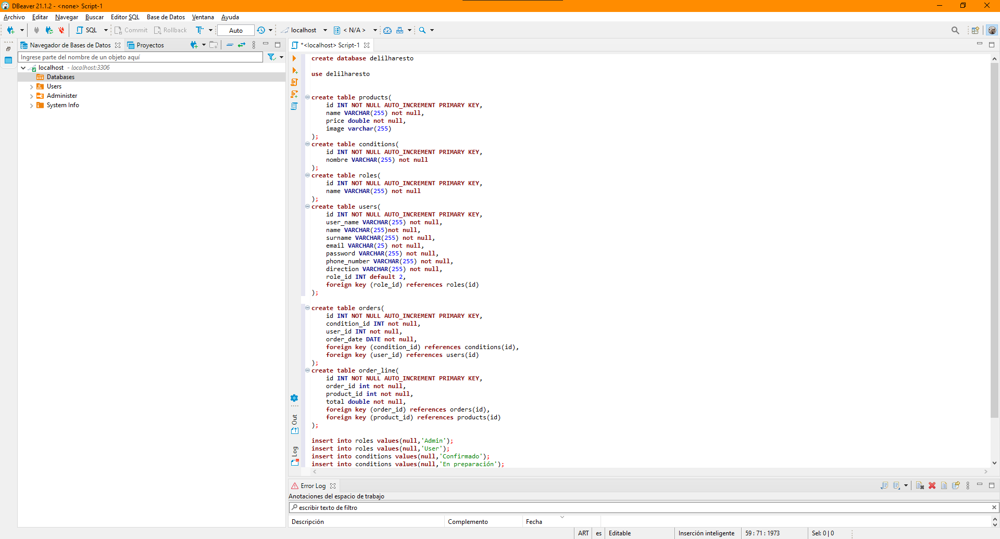

# Delilah Restó

_Este proyectyo consta de la construccion de una rest API para una app de pedidos de un restaurante_

## Comenzando 🚀

_Lo primero que debes hacer para montar el servidor en tu computadora es abrir el proyecto con **Visual Studio Code**_

### Pre-requisitos 📋

* _Uno de los requisitos para poder levantar el servidor es instalar **NodeJs** y **NPM** en tu computadora, Para eso podes seguir esta pequeña guia_

```
https://www.cursosgis.com/como-instalar-node-js-y-npm-en-4-pasos/
```
_O podes entrar a la pagina oficial de NodeJs descargar el instalador correspondiente a tu sistema operativo y version y seguir los pasos que te indica_
```
https://nodejs.org/es/download/
```

* _Lo siguiente que tenemos que instalar es **MariaDB** en la computadora para que podamos interpretar las instrucciones de la base de datos, para eso podes seguir esta pequeña guia_
```
https://techexpert.tips/es/windows-es/instalacion-de-mariadb-en-windows/
```
_O tambien podes entrar a la pagina oficial de MariaDB y seguir las instrucciones_
```
https://mariadb.com/downloads/#mariadb_platform-mariadb_server
```
* _Y por ultimo tenemos que intalar **DBeaver** para ejecutar las intrucciones y datos de la bsae de datos, aunque se pueden instalar otros administradores de bases de datos si lo desean_

_Para instalar DBeaver podes seguir esta pequeña guia_
```
https://luissoto.website/como-instalar-y-configurar-dbeaver-en-windows-10/
```
_O podes entrar a la pagina oficial de DBeaver y seguir los pasos para su instalacion_
```
https://dbeaver.io/download/
```

### Instalación 🔧

_Ahora si con Node y Npm instalados tenes que abrir el proyecto con Visual Studio Code, y en la terminal que trae integrada el editor de codigo, deberas correr el siguiente comando, para instalar todas las dependencias y librerias que va a utilizar el proyecto_
```
npm i
```

_una vez intaladas las dependencias deberas abrir DBeaver y crear la base de datos como se muestra a continuacion_

<p>
  
</p>
<p>
  
</p>

_La contraseña correspondiente a la base puede ser cualquiera pero por defecto te recomiendo que pongas root_

<p>
  
</p>

_Lo siquiente es abrir un script para ingresar los datos y tablas de la base de datos_

<p>
  
</p>

_para crear la base de datos deberas copiar todo el codigo que esta en el archivo **data_bases.sql** y pegarlo en el script que abriste y por ultimo ejecutarlo_

<p>
  
</p>

_Podes ejecuralo de dos manera_

* Desde el simbolo indicado en la img siguiente
* O colocando el mouse en cada una de las lineas y apretar **ctrl+enter** de manera secuencial,(Tabla por tabla) de arriba hacia abajo

<p>
  
</p>

## Iniciando el servidor 💻

### Si dejaste la configuracion por defecto de la DB puedes saltarte esto

_antes de poner arriba nuestro servidor tenes quie ir al archivo **.env** y corroborar los datos que hay en el si no son los correspondientes a los que tienes en tu base de datos deberas cambiarlos para que funcione_

### Todo listo

_una vez que corremos el script de la base de datos en DBeaver tenemos que ir a nuestro editor de codigo y ejecutar el siguiente comando el la terminal_
```
npm run dev
```
### Y listo nuestro servidor ya esta arriba

## Documentacion📖
_Con el servidor ya levantado para poder ver la documentacion del proyecto, desde el navegador tenemos que pegar la siguiente url_

```
http://localhost:3000/api-docs
```
_Mas Ejemplos de los endpoint en postman_
```
https://www.postman.com/blue-star-799371/workspace/delilha-resto/overview
```
